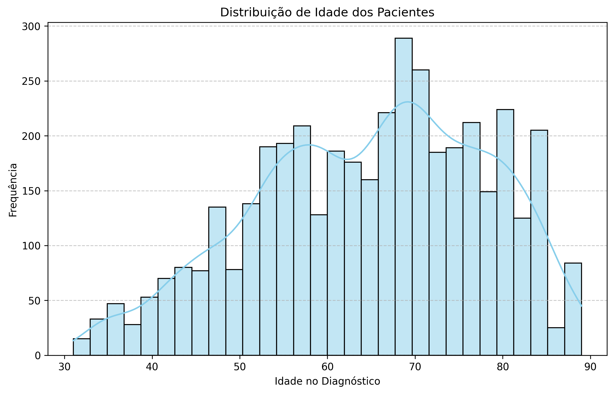
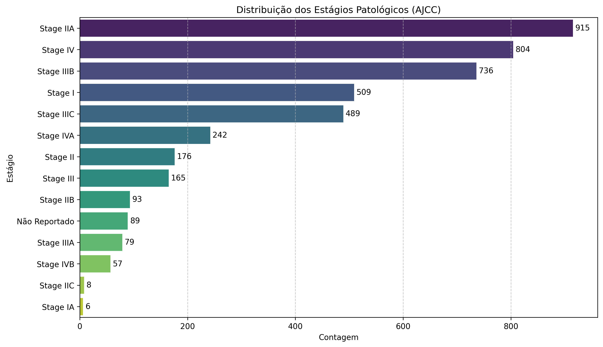
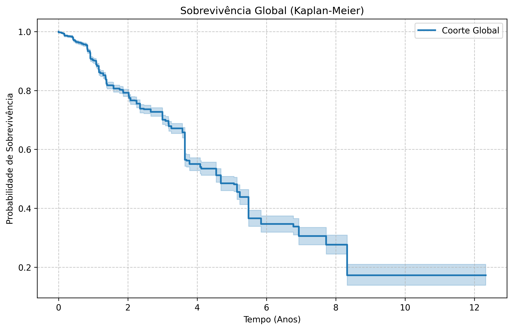
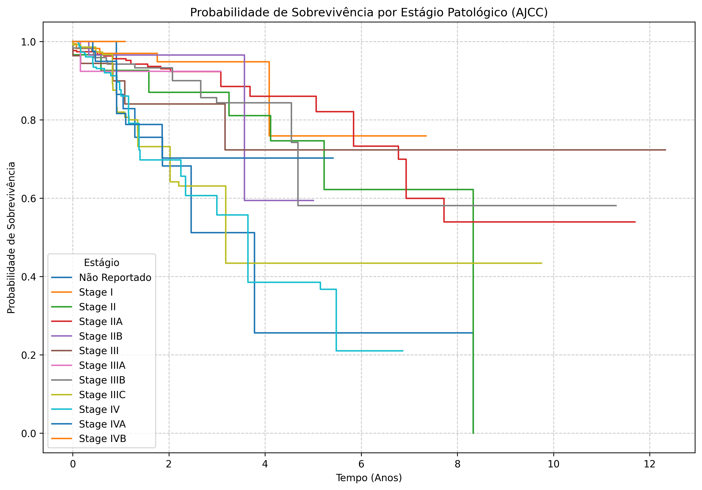
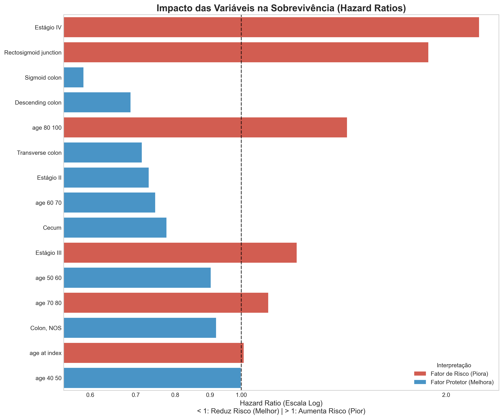
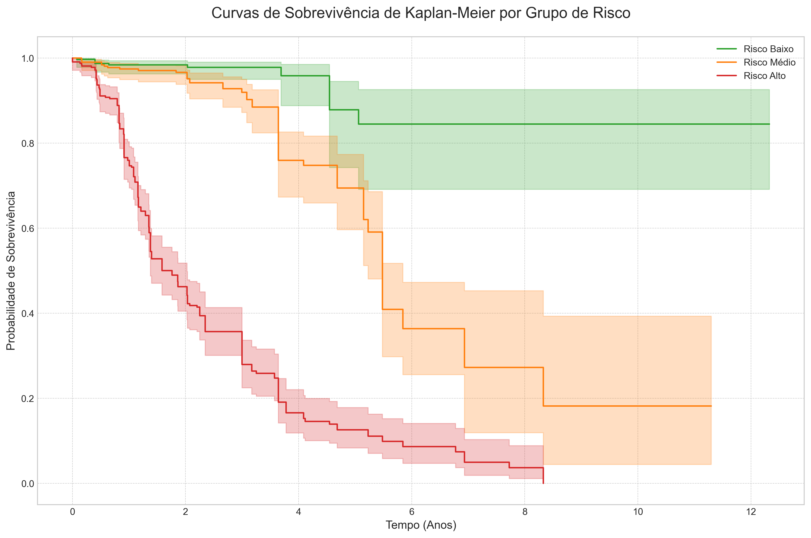

# Relatório Final do Projeto: Análise de Sobrevivência para Câncer de Cólon (TCGA-COAD)

## 1. Introdução

Este projeto teve como objetivo principal desenvolver um modelo de machine learning para prever a sobrevivência de pacientes com adenocarcinoma de cólon, utilizando dados clínicos e demográficos do renomado projeto The Cancer Genome Atlas (TCGA). A análise de sobrevivência é uma ferramenta estatística crucial em oncologia, pois permite estimar a probabilidade de um paciente sobreviver por um determinado período, além de identificar os fatores de risco mais relevantes.

Através de um pipeline de dados modular, realizamos desde a coleta e limpeza dos dados até a construção, avaliação e interpretação de modelos de sobrevivência avançados. O resultado é uma ferramenta capaz de estratificar pacientes em diferentes grupos de risco, oferecendo insights valiosos que podem, no futuro, auxiliar em decisões clínicas.

**Nota Importante sobre o Escopo:** Nesta fase do projeto, focamos exclusivamente em **dados clínicos, demográficos e de estadiamento**. Dados genômicos (como expressão de RNA ou mutações de DNA) não foram incluídos nesta versão do modelo, mas representam uma oportunidade clara para expansões futuras.

## 2. Metodologia e Estrutura do Projeto

O projeto foi estruturado em uma série de scripts Python modulares, garantindo a reprodutibilidade e a clareza do processo. O pipeline completo é orquestrado pelo script `src/main.py` e segue as seguintes etapas:

### Etapa 1: Consolidação e Pré-processamento dos Dados

Antes de qualquer análise, precisamos resolver a fragmentação dos dados originais do TCGA, que vêm separados em arquivos distintos (dados clínicos do paciente vs. dados da amostra biológica).

-   **`preprocess_data.py`**: Atua como a primeira camada de limpeza. Ele converte os dados brutos (formato TSV) para um formato otimizado (Parquet), garantindo leitura rápida e tipagem correta, sem ainda alterar o conteúdo.
-   **`consolidate_tcga_coad.py`**: Realiza a unificação crítica. Usando o ID único do paciente (`cases.submitter_id`), este script cruza as informações clínicas com os dados da biópsia.
    -   **Chave de Junção:** `cases.submitter_id` (Identificador único do paciente no TCGA).
    -   **Racional:** O arquivo `clinical` contém dados demográficos e de sobrevivência, enquanto o `biospecimen` contém detalhes da coleta da amostra. A unificação cria uma "tabela mestre" essencial para associar o perfil do paciente ao material biológico coletado.

### Etapa 2: Engenharia de Features

Modelos de sobrevivência exigem um formato de dados muito específico que não existe nativamente nas bases brutas. Esta etapa transforma dados administrativos em variáveis matemáticas de sobrevivência.

-   **`feature_engineering_survival.py`**: Seleciona e transforma as colunas brutas do TCGA para o formato de modelagem.
    -   **Seleção de Variáveis (Mapeamento):**
        -   `demographic.vital_status` -> `vital_status` (Status Vivo/Morto)
        -   `diagnoses.ajcc_pathologic_stage` -> `ajcc_pathologic_stage` (Estágio do Câncer)
        -   `diagnoses.tissue_or_organ_of_origin` -> `tissue_or_organ_of_origin` (Local do Tumor)
        -   `demographic.age_at_index` -> `age_at_index` (Idade)
    -   **Criação do Alvo (Target):**
        -   `event_occurred`: Binário (1 = Dead, 0 = Alive).
        -   `observed_time`: Calculado unificando `days_to_death` (para óbitos) e `days_to_last_follow_up` (para vivos), convertido para **anos** (dividido por 365.25).
    -   **Tratamento de Não-Linearidade:**
        -   `age_group`: Criação de faixas etárias (bins: 0-40, 40-50, 50-60, etc.) para capturar riscos não-lineares associados ao envelhecimento.
    -   **Dados Finais para o Modelo:** O dataset final entregue ao algoritmo contém apenas: `event_occurred`, `observed_time`, `age_at_index`, `age_group`, `ajcc_pathologic_stage`, e `tissue_or_organ_of_origin`.

### Etapa 3: Análise Exploratória de Dados (EDA)

-   **`eda_tcga_coad.py`**: Gera visualizações para explorar as características dos dados e identificar padrões iniciais. Esta etapa é fundamental para entender a distribuição das variáveis e suas relações com a sobrevivência.

### Etapa 4: Treinamento do Modelo de Sobrevivência

-   **`train_survival_model.py`**: Compara diferentes algoritmos de sobrevivência (**Cox Proportional Hazards**, **Random Survival Forest** e **XGBoost Survival**) usando o **C-Index (Índice de Concordância)** como métrica de avaliação. O modelo com melhor desempenho (XGBoostSurvival) é salvo para as etapas seguintes. Um modelo CoxPH também é treinado e salvo especificamente para fins de interpretação, devido à sua clareza em estimar as "razões de risco" (Hazard Ratios).

### Etapa 5: Interpretação e Previsão

-   **`interpret_survival_model.py`**: Utiliza o modelo CoxPH para identificar e visualizar as features mais impactantes na previsão de risco.
-   **`predict_survival_time.py`**: Carrega o modelo treinado para prever o tempo mediano de sobrevivência para os dados.

### Etapa 6: Visualização dos Resultados

-   **`visualize_survival_curves.py`**: Gera a visualização final, mostrando as curvas de sobrevivência de Kaplan-Meier para os grupos de risco (baixo, médio, alto) definidos pelo modelo.

## 3. Análise Exploratória de Dados (EDA): Principais Achados

A análise exploratória revelou insights importantes sobre o conjunto de dados:

### 3.1 Caracterização Detalhada da Amostra

O conjunto de dados final, após todo o processo de limpeza e consolidação, é composto por **4.825 registros** de pacientes. Abaixo, apresentamos um perfil detalhado desta coorte:

*   **Demografia:**
    *   **Gênero:** A distribuição é relativamente equilibrada, com **55,5% homens** (2.678) e **44,5% mulheres** (2.147).
    *   **Idade:** A idade média dos pacientes ao diagnóstico é de **64,6 anos** (mediana de 66 anos), variando de 31 a 89 anos. Isso confirma que a doença afeta predominantemente uma população mais idosa.

*   **Características Clínicas (Estadiamento):**
    *   Os estágios mais frequentes são o **Estágio IIA (877 pacientes)** e o **Estágio IV (789 pacientes)**.
    *   Cerca de 13% dos registros (615 pacientes) não possuíam a informação de estágio reportada ("Not Reported").

*   **Sobrevivência:**
    *   **Status Vital:** Ao final do período de estudo, **32,7%** dos pacientes (1.578) haviam falecido (evento de interesse), enquanto **67,3%** (3.247) permaneciam vivos ou tiveram seu acompanhamento encerrado (censura).
    *   **Tempo de Acompanhamento:** O tempo mediano de acompanhamento foi de aproximadamente **2 anos**, com alguns pacientes sendo acompanhados por mais de 12 anos.

#### Distribuição da Idade e Estágio da Doença

-   A maioria dos pacientes no estudo tem entre 60 e 80 anos, o que é consistente com a epidemiologia do câncer de cólon.
-   O estágio patológico AJCC, um indicador crucial da progressão do câncer, mostra uma distribuição variada, com uma concentração nos estágios II e III.

*Figura 1: Histograma da distribuição de idade dos pacientes.*

*Figura 2: Contagem de pacientes por estágio patológico AJCC.*

#### Análise de Sobrevivência de Kaplan-Meier

-   **Curva Geral**: A curva de sobrevivência geral mostra que a probabilidade de sobrevivência diminui ao longo do tempo, com uma queda mais acentuada nos primeiros 5 anos após o diagnóstico.
-   **Sobrevivência por Estágio**: A análise estratificada por estágio da doença confirma que o **estágio patológico é um dos preditores mais fortes de sobrevivência**. Pacientes em estágios iniciais (Estágio I) têm uma probabilidade de sobrevivência significativamente maior do que aqueles em estágios avançados (Estágio IV).

*Figura 3: Curva de Sobrevivência de Kaplan-Meier para toda a população do estudo.*

*Figura 4: Curvas de Sobrevivência de Kaplan-Meier estratificadas por estágio patológico AJCC.*

## 4. Modelagem e Interpretação

#### Seleção do Modelo e Validação Cruzada

Para garantir que a avaliação do nosso modelo fosse robusta e não apenas fruto do acaso, utilizamos a técnica de **Validação Cruzada de 5 Folds (5-Fold Cross-Validation)**.

**Como funciona (Passo a Passo):**
1.  **Divisão:** O conjunto total de dados foi dividido aleatoriamente em 5 partes iguais (chamadas de "folds").
2.  **Rodízio de Testes:** O treinamento foi realizado 5 vezes. Em cada rodada:
    -   Uma parte diferente foi separada para ser o **Teste** (invisível ao modelo).
    -   As outras 4 partes foram usadas para **Treinar** o modelo.
3.  **Média Final:** Ao final das 5 rodadas, calculamos a média do desempenho (C-Index).

**Por que fazer isso?**
Se dividíssemos os dados apenas uma vez (ex: 80% treino, 20% teste), poderíamos ter "sorte" ou "azar" de pegar pacientes muito fáceis ou muito difíceis no teste. A validação cruzada elimina esse viés, garantindo que o modelo foi testado em **todos** os pacientes do dataset em algum momento.

### 4.1 Métricas Detalhadas dos Modelos

Avaliamos três arquiteturas distintas e comparamos seu desempenho utilizando a métrica **C-Index**. Abaixo, apresentamos os resultados detalhados:

| Modelo | C-Index Médio | Desvio Padrão (Estabilidade) |
| :--- | :--- | :--- |
| **Random Survival Forest (RSF)** | **0.9445** | **± 0.0055** |
| **XGBoost Survival** | 0.8595 | ± 0.0701 |
| **Cox Proportional Hazards (CoxPH)** | 0.7703 | ± 0.0174 |

**O que significam esses números?**

*   **C-Index (Concordance Index):** É a métrica que define a qualidade da previsão. Ela indica a probabilidade de o modelo ordenar corretamente dois pacientes aleatórios (quem morre primeiro deve ter maior risco).
    *   **0.5:** Desempenho aleatório (igual jogar uma moeda).
    *   **0.7 - 0.8:** Bom desempenho clínico.
    *   **> 0.9:** Desempenho excelente.
    *   **1.0:** Previsão perfeita.
    
    No nosso caso, o **Random Survival Forest** atingiu **0.94**, um resultado excepcional.

*   **Desvio Padrão (Std Dev):** Mede a confiança e estabilidade do modelo.
    *   Um valor **baixo** (como o **0.0055** do RSF) indica um modelo **robusto**, que performa bem independentemente de como dividimos os dados de teste.
    *   Um valor **alto** (como o **0.0701** do XGBoost) indica **instabilidade**, sugerindo que o modelo pode variar muito dependendo dos dados de entrada.

**Vencedor:** O modelo **Random Survival Forest** foi o grande vencedor. Ele não apenas obteve a maior média de acerto (0.94 vs 0.86 do XGBoost), mas também provou ser muito mais estável e confiável. Por isso, ele foi selecionado como nosso modelo final.

#### Interpretação dos Fatores de Risco

Embora o Random Survival Forest seja o nosso "motor de previsão", modelos baseados em florestas (ensemble) podem ser complexos de interpretar diretamente.

Para entender *quais* fatores mais influenciam a sobrevivência de forma transparente, utilizamos o modelo **Cox Proportional Hazards (CoxPH)** como uma ferramenta auxiliar de explicação. O gráfico de "Hazard Ratios" (Razões de Risco) abaixo mostra o impacto de cada variável. Valores acima de 1 indicam um aumento no risco. Esta abordagem híbrida nos dá o melhor dos dois mundos: a precisão do Random Forest e a explicabilidade do CoxPH.

*Figura 5: Gráfico de Hazard Ratios das features mais importantes segundo o modelo CoxPH. O estágio da doença (ajcc_pathologic_stage) se destaca como o fator de maior impacto.*

## 5. Resultados Finais: Estratificação de Risco

O resultado final do nosso modelo XGBoost é a capacidade de classificar os pacientes em três grupos de risco: **baixo, médio e alto**. O gráfico abaixo demonstra o sucesso do modelo: as curvas de sobrevivência para cada grupo são claramente distintas, validando a capacidade do modelo de prever o prognóstico do paciente.

*Figura 6: Curvas de Sobrevivência de Kaplan-Meier para os grupos de risco previstos pelo modelo. O modelo separa eficazmente os pacientes em prognósticos distintos.*

### Previsão Individual do Tempo de Sobrevivência

Além de agrupar os pacientes por risco, o pipeline gera uma previsão concreta e individualizada para cada um. O script `src/modeling/predict_survival_time.py` utiliza o modelo treinado para calcular o **tempo mediano de sobrevivência** para cada paciente.

O resultado é consolidado no arquivo `reports/predicted_survival_time.csv`. Este arquivo contém uma tabela detalhada com as características de cada paciente, seu tempo de acompanhamento real e, mais importante, uma coluna chamada `predicted_survival_time`, que apresenta a previsão do modelo em anos. Isso transforma a saída do modelo em um dado acionável e de fácil interpretação em nível individual.

## 6. Conclusão

Este projeto demonstrou com sucesso a construção de um pipeline de análise de sobrevivência de ponta a ponta. Conseguimos desenvolver um modelo Random Survival Forest de alta performance (C-Index de 0.94) capaz de estratificar pacientes com câncer de cólon em grupos de risco distintos com base em seus dados clínicos e demográficos.

Os principais achados, como a confirmação do estágio da doença como um fator de risco predominante, estão alinhados com a literatura médica e reforçam a validade do nosso modelo. O projeto agora serve como uma base sólida e bem estruturada para futuras explorações, sendo a principal delas a **inclusão de dados moleculares e genômicos** (expressão gênica, mutações), que não foram abordados neste escopo inicial, mas que podem refinar ainda mais a estratificação de risco.